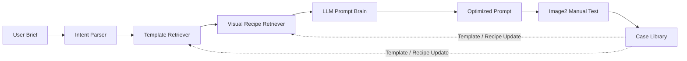

# Advertising Image Prompt Agent

Open-source advertising image prompt agent for turning business briefs and reference images into optimized image-generation prompts.

This repository is the **Community Edition** of an advertising vertical prompt agent. It focuses on the prompt planning layer before image generation: intent parsing, advertising templates, visual recipes, deterministic prompt checks, reference image policy, and a local Web workbench.


## Why It Exists

General image-generation prompts are unstable for advertising production. A local shop owner may say "make a milk tea storefront signboard", but production-ready output needs structure: task type, industry, copywriting, aspect ratio, material constraints, reference image policy, and clear composition.

This agent turns that loose brief into an optimized prompt that can be manually tested in Image2 or another image-generation tool.

## Core Features

- Advertising vertical coverage: storefront signboards, posters, roll-up banners, event backdrops, wayfinding signage, brand walls, local promotions, ecommerce main images, product ads, and commercial photography.
- Community template library: 120 business templates and 75 visual recipes.
- LLM prompt brain: uses a Responses-compatible LLM endpoint to refine the rule prompt.
- Reference image policy: user uploads can be read by the LLM and marked for later Image2 editing; upstream references are only used for visual understanding.
- Deterministic prompt validation: removes vague expressions and requires composition, lighting, typography, material, and image-reference policy.
- Local Web UI: prompt workbench with brief input, optimized prompt output, preview placeholder, and retrieval signals.

## Quick Start

```bash
pnpm install
pnpm --filter ad-image-agent-core test
pnpm --filter ad-image-agent build
export OPENAI_API_KEY="your_api_key"
pnpm --filter ad-image-agent serve:llm
```

Open:

```text
http://127.0.0.1:5174
```

The app does not call an image-generation API in this edition. Copy the optimized prompt into your image-generation tool and upload user reference images when the app marks them for Image2 participation.

## Architecture



## Community vs Commercial

| Capability | Community Edition | Commercial Edition |
| --- | --- | --- |
| Local Web UI | Included | Included |
| Core prompt agent framework | Included | Included |
| Business templates | 120 | Full private library |
| Visual recipes | 75 | Full private library |
| LLM prompt brain | Interface + local server | Production setup |
| Image generation | Manual adapter | Real adapters and storage |
| ERP integration | Overview docs | Connectors, field mapping, deployment |
| Case gallery | Public samples | Private scored case library |

Commercial work can add ERP connectors, real image-generation adapters, deployment support, private template libraries, and production case evaluation.

## Repository Layout

```text
apps/ad-image-agent              Local Web workbench
packages/ad-image-agent-core     Parser, retrievers, compiler, adapters, tests
examples                         Sample briefs and generated records
docs                             Architecture, adapter, ERP, authoring, roadmap
scripts                          Community validation and asset counting
```

## Development

```bash
pnpm --filter ad-image-agent-core test
pnpm --filter ad-image-agent-core build
pnpm --filter ad-image-agent typecheck
pnpm --filter ad-image-agent build
```

## License

Apache-2.0. See [LICENSE](LICENSE).
