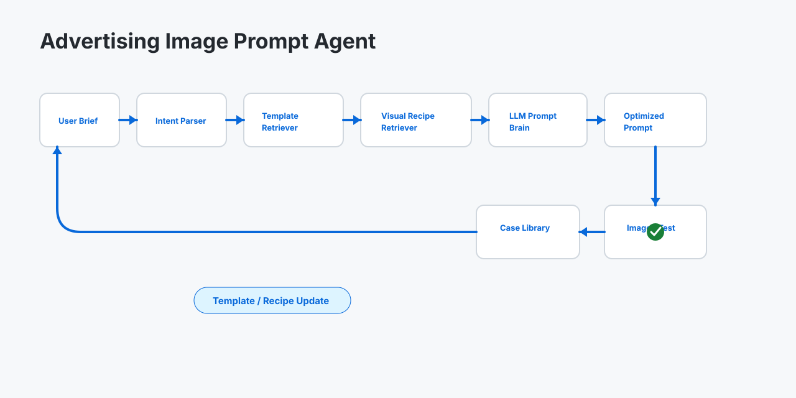
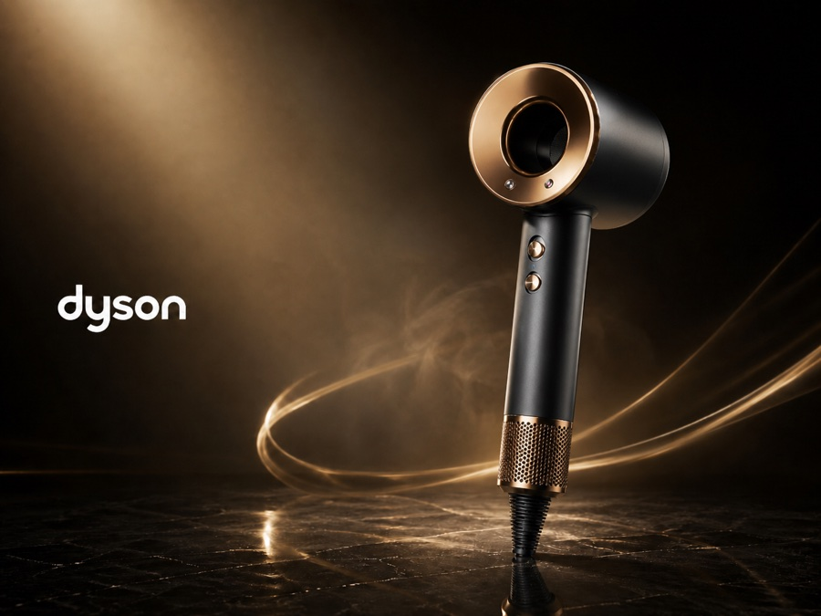
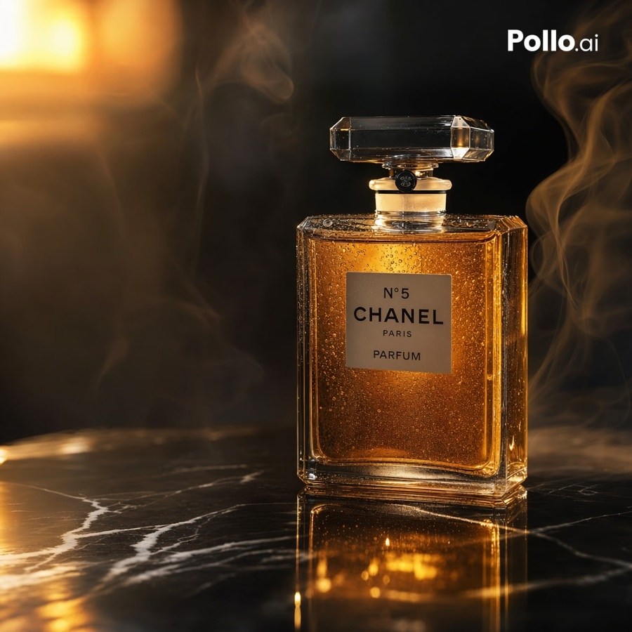
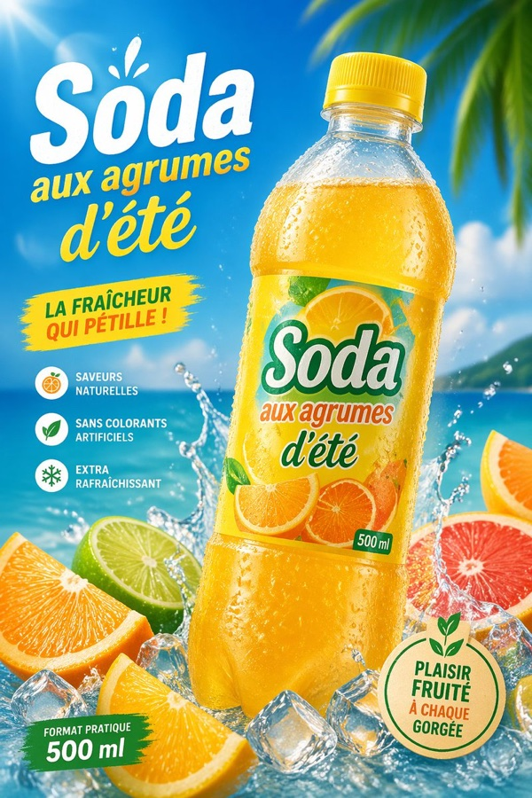
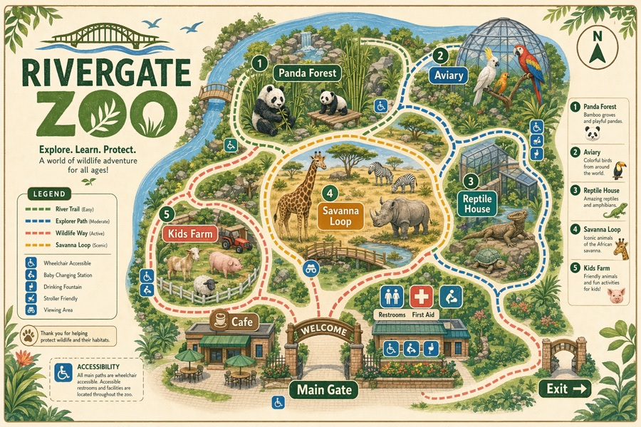
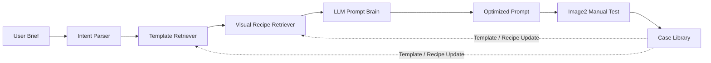

# Image2 Ads Studio

面向 Image2 广告作图的开源 Prompt Studio：把业务白话需求和参考图，转成适合商业广告出图测试的优化提示词。

这是 **Community Edition**。它开源 Prompt Agent 框架、本地 Web 工作台、120 条业务模板和 75 条视觉配方；商业版保留完整模板库、ERP 集成、真实生图链路和生产案例库。



## Prompt Gallery

公开 gallery 目前包含 50 个“一张图 + 一份 optimized prompt”的案例：2 张项目自有生图概念图、28 张第一批上游广告参考图，以及 20 张新增多源参考图，覆盖品牌系统、导视图、商业摄影、电商详情页、产品海报和灯箱 mockup。每个案例都包含预览图、Image2 可用提示词和具体来源标注。

查看完整案例：[examples/gallery/cases.md](examples/gallery/cases.md)

| Preview | Optimized Prompt Excerpt |
| --- | --- |
|  | **Beverage Product Ad Concept**<br><br>`Create a commercially usable 16:9 beverage advertising hero image for a new debranded sparkling drink. Composition: place a tall matte-gloss red can slightly right of center...` |
|  | **Premium Appliance Product Ad Concept**<br><br>`Create a 16:9 premium consumer-electronics product advertising hero image for a debranded high-end airflow appliance. Use a black-and-champagne-gold cylindrical device...` |
|  | **Luxury Amber Perfume Ad**<br><br>`Create a square 1:1 luxury beauty product advertisement for a debranded amber perfume bottle. Show one classic rectangular glass bottle as the hero object...` |
|  | **Tropical Citrus Soda Ad Poster**<br><br>`Create a 9:16 vertical commercial beverage poster for a tropical citrus soda campaign. Show one large transparent plastic bottle as the hero object...` |
|  | **Moss Radio Brand Identity Showcase Board**<br><br>`Create a square 1:1 brand-identity showcase board for a fictional audio, retail, or culture-focused business. Build a dense editorial presentation...` |
|  | **Zoo Visitor Wayfinding Map**<br><br>`Create a polished 16:9 advertising-style wayfinding map board for a fictional wildlife park campaign, designed as a commercially usable tourism graphic...` |
|  | **E-Commerce Product Detail Page Layout**<br><br>`Create a 9:16 vertical e-commerce product detail poster for a futuristic consumer electronics hero product. Use a dense marketplace layout...` |

来源与许可证说明见 [gallery attribution](examples/gallery/ATTRIBUTION.md)。上游 prompt 和图片只作为结构参考；公开 prompt 已由本项目流程重新生成、去品牌化并改写为可复用版本。

## 价值

广告制作需求通常不是一句 prompt 能稳定解决的。比如“做一个奶茶店门头效果图”，真正可执行的作图指令需要包含作图类型、行业、文案、画幅、材质、灯光、参考图保留策略和负面约束。

Image2 Ads Studio 的目标是把前期需求整理成结构化作图方案，并输出 LLM 优化后的 final prompt，供 Image2 或其他图像生成工具手动测试。

## 功能亮点

- 覆盖广告图文高频场景：门头、海报、展架、背景板、导视、形象墙、本地促销、电商主图、产品广告、商业摄影。
- 社区版内置 120 条业务模板和 75 条视觉配方。
- 支持 LLM Prompt Brain，对规则 prompt 做二次优化。
- 支持用户上传图的多模态分析边界。
- 支持确定性 prompt 校验，减少“高级感”“某某风格”这类模糊表达。
- 提供本地 Web 工作台：需求配置、优化提示词、结果预览、检索信号、JSON 下载。

## 快速开始

```bash
pnpm install
pnpm --filter ad-image-agent-core test
pnpm --filter ad-image-agent build
export OPENAI_API_KEY="your_api_key"
pnpm --filter ad-image-agent serve:llm
```

访问：

```text
http://127.0.0.1:5174
```

社区版当前不直接调用真实生图 API。你可以复制优化后的 prompt 到 Image2 网页，并按界面提示上传用户参考图。

## 架构



## 社区版与商业版

| 能力 | 社区版 | 商业版 |
| --- | --- | --- |
| 本地 Web UI | 包含 | 包含 |
| 核心 Prompt Agent 框架 | 包含 | 包含 |
| 业务模板 | 120 条 | 完整私有库 |
| 视觉配方 | 75 条 | 完整私有库 |
| LLM Prompt Brain | 接口与本地服务 | 生产化部署 |
| 图片生成 | 手动测试 Adapter | 真实生图 Adapter 与存储 |
| ERP 集成 | 文档说明 | 字段映射、连接器、部署支持 |
| 案例库 | 公开样例 | 私有评分案例库 |

## License

Apache-2.0。详见 [LICENSE](LICENSE)。
